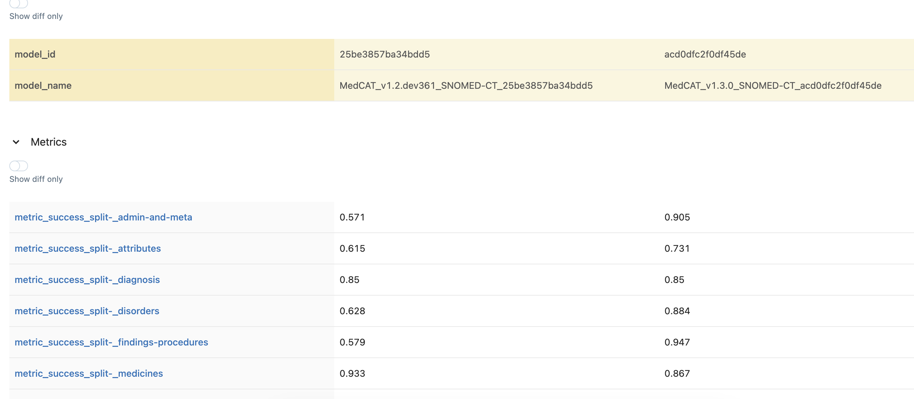

# The _medcatmlflow_ package is designed to measure metrics of and serve MedCAT models.

It uses `mlflow` for model tracking and serving.

It uses regression tooling within `medcat` to generate metrics.


# Installing _medcatmlflow_

It is recommended to install the package on a local environment (i.e create one with `python -m venv venv` and activate using `source venv/bin/activate` if you do not have access to one).

The package can be installed using 
```
pip install .
```
That will use the `pyproject.toml` file to install the package along with the necessary dependencies.


# How to use _medcatmlflow_


## Prerequisites

In order to run some regression tests you will need to have
- A MedCAT model (version 1.3+ should work)
- At least one regression test suite (multiple recommended)
  - Take a look at the regression test tutorial ([here](https://htmlpreview.github.io/?https://github.com/CogStack/MedCATtutorials/blob/main/notebooks/specialised/Comparing_Models_with_RegressionSuite.html)) for specifics on how to generate these


## Running regression suites on a model

Once you've installed the package and have got the prerequisites all you need to do is run
```
python src/tracker.py <model_pack_path> <regression_suite_path1> [regression_suite_path2] ...
```
NOTE: In most terminals can use `*` to specifiy multiple regression suite paths at once (e.g by passing `regression_suite*.yml`).

This will run the specified regression suite(s) against the specified model as well as save the metrics and the model within `mlflow`.

You can also run `python src/tracker.py --help` to find other arguments that are available.


## Checking the results and getting the models

Currently, the models are simply handled by `mlflow`.
So you can see them through its built in user interface (UI).

You can access it by running
```
mfllow ui
```
You will then be able to access the UI at _http://127.0.0.1:5000/_ (by default).

If you press **Experiments** at the top, you will be able to see the recorded experiments/models.

If you tick multiple models, you will be able to compare their metrics between eachother.
E.g

<!-- originally 2740 × 1200 -->
<!-- doing quarter size 685 x 300 -->


If you wish to access a specific model, you need to click on _pyfunc_ under the _Models_ column for the experiment / model you wish to acces.

